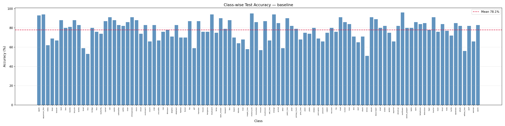
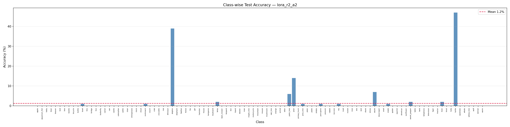
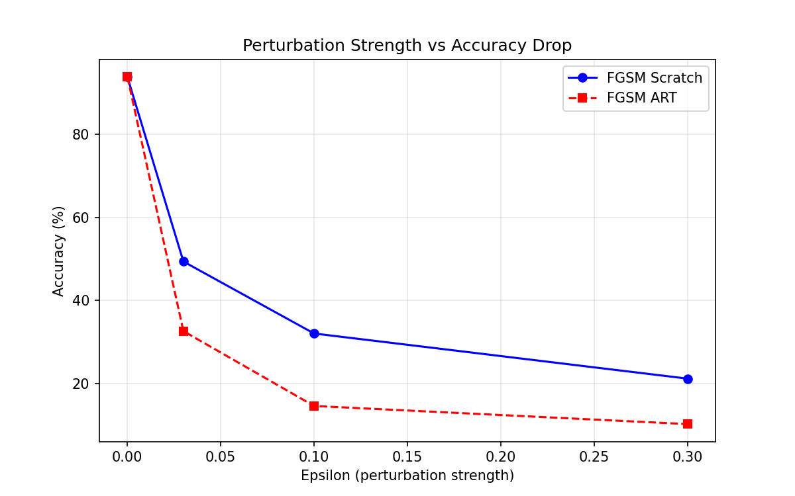
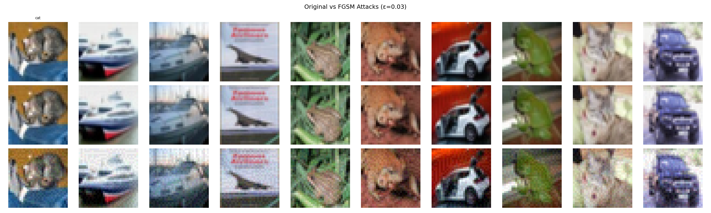

# DLOps Assignment 5

**Author:** Vidhan Savaliya · Roll No: M25CSA031 · IIT Jodhpur

| | |
|---|---|
| **WandB Q1** | [](https://wandb.ai/vidhan-savaliya-indian-institute-of-technology-jodhpur/dlops-ass5-q1/overview) |
| **WandB Q2** | [](https://wandb.ai/vidhan-savaliya-indian-institute-of-technology-jodhpur/dlops-ass5-q2?nw=nwuservidhansavaliya) |
| **HuggingFace** | [](https://huggingface.co/Vidhansavaliya123) |

---

## Table of Contents

1. [Project Structure](#project-structure)
2. [Installation](#installation)
3. [Q1 — ViT-S LoRA Fine-tuning on CIFAR-100](#q1--vit-s-lora-fine-tuning-on-cifar-100)
4. [Q2 — Adversarial Attacks using IBM ART on CIFAR-10](#q2--adversarial-attacks-using-ibm-art-on-cifar-10)
5. [Results](#results)
6. [Links](#links)

---

## Project Structure

```
DLops_ASS_5/
├── Dockerfile                   # CUDA-enabled Docker container
├── docker-compose.yml           # Docker Compose config
├── requirements.txt             # Python dependencies
├── README.md
├── report.tex                   # LaTeX source
├── report.pdf                   # Final PDF report
│
├── Q1_ViT_LoRA/
│   ├── dataset.py               # CIFAR-100 dataloader (224×224, ImageNet stats)
│   ├── model.py                 # ViT-S baseline + LoRA model builders
│   ├── utils.py                 # Train/eval loop, grad norm logging, WandB helpers
│   ├── train.py                 # Main training script (all 10 configurations)
│   ├── test.py                  # Class-wise accuracy + histogram generator
│   ├── optuna_search.py         # Optuna hyperparameter search
│   └── push_to_hub.py           # Push best model to HuggingFace Hub
│
├── Q2_Adversarial/
│   ├── train_resnet18.py        # ResNet-18 from scratch on CIFAR-10
│   ├── fgsm_scratch.py          # FGSM attack (pure PyTorch, no ART)
│   ├── fgsm_art.py              # FGSM attack via IBM ART
│   ├── compare_attacks.py       # Visual comparison + ε vs accuracy plot
│   ├── detector_pgd.py          # ResNet-34 binary detector (clean vs PGD)
│   ├── detector_bim.py          # ResNet-34 binary detector (clean vs BIM)
│   └── wandb_visualize.py       # Upload 10-sample attack images to WandB
│
├── plots/                       # Generated visualization plots
│   ├── baseline_classwise.png
│   ├── lora_r2_a2_classwise.png
│   ├── eps_vs_accuracy.png
│   └── fgsm_comparison.png
│
└── weights/                     # Saved model checkpoints
    ├── Q1_baseline.pth          # Baseline ViT-S head-only
    ├── Q1_lora_r4_a4_best/      # Best LoRA model (HuggingFace PEFT format)
    │   ├── adapter_config.json
    │   └── adapter_model.safetensors
    ├── Q1_lora_r2_a2_best/      # All LoRA checkpoints (r×a combinations)
    ├── Q1_lora_r2_a4_best/
    ├── Q1_lora_r2_a8_best/
    ├── Q1_lora_r4_a2_best/
    ├── Q1_lora_r4_a8_best/
    ├── Q1_lora_r8_a2_best/
    ├── Q1_lora_r8_a4_best/
    ├── Q1_lora_r8_a8_best/
    └── Q2_resnet18_clean.pth    # Trained ResNet-18 (93.79% CIFAR-10)
```

---

## Installation

### Prerequisites

- Docker with NVIDIA GPU support (recommended), **or** Python 3.10+
- WandB account and API key
- HuggingFace token (for pushing models)

### Option A — Docker (Required by Assignment)

```bash
# Build image
docker build -t dlops_ass5 .

# Run with GPU and credentials
docker run --gpus all \
  -e WANDB_API_KEY=<your_wandb_key> \
  -e HF_TOKEN=<your_hf_token> \
  -v $(pwd):/workspace \
  -w /workspace \
  dlops_ass5 bash
```

### Option B — Local Python (3.10+)

```bash
pip install -r requirements.txt

# Set credentials
export WANDB_API_KEY=<your_wandb_key>      # Linux/macOS
export HF_TOKEN=<your_hf_token>
# OR on Windows PowerShell:
$env:WANDB_API_KEY = "<your_wandb_key>"
$env:HF_TOKEN = "<your_hf_token>"
```

**`requirements.txt` includes:**
```
torch>=2.0
torchvision
timm
peft
transformers
huggingface_hub
wandb
optuna
adversarial-robustness-toolbox[pytorch]
matplotlib
numpy
tqdm
```

---

## Q1 — ViT-S LoRA Fine-tuning on CIFAR-100

### Training

```bash
cd Q1_ViT_LoRA

# Train baseline only (frozen backbone, trainable head)
python train.py --mode baseline

# Train single LoRA configuration
python train.py --mode lora --rank 4 --alpha 4 --dropout 0.1 --epochs 10

# Train ALL 10 configurations (baseline + 9 LoRA combos) sequentially
python train.py --mode all

# Run Optuna hyperparameter search (30 trials)
python optuna_search.py --n_trials 30 --data_dir ./data
```

### Testing

```bash
cd Q1_ViT_LoRA

# Evaluate baseline
python test.py --mode baseline \
               --checkpoint ../weights/Q1_baseline.pth

# Evaluate best LoRA model (r=4, α=4)
python test.py --mode lora \
               --checkpoint ../weights/Q1_lora_r4_a4_best \
               --rank 4 --alpha 4

# Evaluate any specific LoRA config
python test.py --mode lora \
               --checkpoint ../weights/Q1_lora_r2_a2_best \
               --rank 2 --alpha 2
```

### Push to HuggingFace

```bash
cd Q1_ViT_LoRA
python push_to_hub.py --checkpoint ../weights/Q1_lora_r4_a4_best \
                      --repo_id vidhansavaliya/dlops-ass5-vit-lora-r4-a4
```

---

## Q2 — Adversarial Attacks using IBM ART on CIFAR-10

### Step 1: Train ResNet-18 from Scratch

```bash
cd Q2_Adversarial
python train_resnet18.py --epochs 50 --data_dir ./data
# Achieves 93.79% test accuracy (target ≥ 72%)
```

### Step 2: FGSM Attacks

```bash
# FGSM from scratch (pure PyTorch)
python fgsm_scratch.py --checkpoint ../weights/Q2_resnet18_clean.pth

# FGSM via IBM ART
python fgsm_art.py --checkpoint ../weights/Q2_resnet18_clean.pth

# Generate visual comparison + ε vs accuracy plot
python compare_attacks.py --checkpoint ../weights/Q2_resnet18_clean.pth --eps 0.03
```

### Step 3: Adversarial Detectors

```bash
# Train PGD-based binary detector (ResNet-34)
python detector_pgd.py \
    --clean_ckpt ../weights/Q2_resnet18_clean.pth \
    --epochs 20

# Train BIM-based binary detector (ResNet-34)
python detector_bim.py \
    --clean_ckpt ../weights/Q2_resnet18_clean.pth \
    --epochs 20
```

### Step 4: Upload WandB Sample Images

```bash
python wandb_visualize.py --checkpoint ../weights/Q2_resnet18_clean.pth
```

---

## Results

### Q1 — Train/Validation Tables

#### Experiment 0 — Baseline (No LoRA) · Trainable Params: 38,500

| Epoch | Train Loss | Val Loss | Train Acc | Val Acc |
|:-----:|:----------:|:--------:|:---------:|:-------:|
| 1  | 2.0691 | 1.6767 | 62.44% | 73.12% |
| 2  | 1.7960 | 1.6248 | 70.40% | 75.04% |
| 3  | 1.7619 | 1.6082 | 71.45% | 75.84% |
| 4  | 1.7292 | 1.6117 | 72.28% | 75.72% |
| 5  | 1.6960 | 1.5989 | 73.31% | 76.10% |
| 6  | 1.6681 | 1.5870 | 74.43% | 76.56% |
| 7  | 1.6513 | 1.5616 | 74.94% | 77.52% |
| 8  | 1.6266 | 1.5511 | 75.94% | 77.96% |
| 9  | 1.6066 | 1.5448 | 76.71% | 78.08% |
| 10 | 1.5914 | 1.5405 | 77.11% | **78.12%** |

#### Experiment 1 — LoRA r=2, α=2, dropout=0.1 · Trainable Params: 75,364

| Epoch | Train Loss | Val Loss | Train Acc | Val Acc |
|:-----:|:----------:|:--------:|:---------:|:-------:|
| 1  | 1.5121 | 1.1957 | 78.53% | 87.72% |
| 2  | 1.2022 | 1.1567 | 87.00% | 88.88% |
| 3  | 1.1536 | 1.1407 | 88.60% | 89.36% |
| 4  | 1.1222 | 1.1324 | 89.63% | 89.10% |
| 5  | 1.0966 | 1.1232 | 90.58% | 89.58% |
| 6  | 1.0767 | 1.1231 | 91.19% | 89.86% |
| 7  | 1.0596 | 1.1179 | 91.90% | 89.62% |
| 8  | 1.0459 | 1.1108 | 92.35% | 90.10% |
| 9  | 1.0345 | 1.1092 | 92.88% | 90.20% |
| 10 | 1.0292 | 1.1076 | 92.93% | **90.24%** |

#### Experiment 2 — LoRA r=2, α=4, dropout=0.1 · Trainable Params: 75,364

| Epoch | Train Loss | Val Loss | Train Acc | Val Acc |
|:-----:|:----------:|:--------:|:---------:|:-------:|
| 1  | 1.5030 | 1.1884 | 78.58% | 87.30% |
| 2  | 1.2009 | 1.1451 | 86.92% | 88.92% |
| 3  | 1.1566 | 1.1408 | 88.40% | 89.18% |
| 4  | 1.1198 | 1.1258 | 89.60% | 89.56% |
| 5  | 1.0971 | 1.1339 | 90.58% | 89.24% |
| 6  | 1.0751 | 1.1145 | 91.32% | 89.90% |
| 7  | 1.0555 | 1.1121 | 91.90% | 89.88% |
| 8  | 1.0398 | 1.1061 | 92.58% | **90.40%** |
| 9  | 1.0254 | 1.1050 | 93.01% | 90.22% |
| 10 | 1.0235 | 1.1027 | 93.23% | 90.28% |

#### Experiment 3 — LoRA r=2, α=8, dropout=0.1 · Trainable Params: 75,364

| Epoch | Train Loss | Val Loss | Train Acc | Val Acc |
|:-----:|:----------:|:--------:|:---------:|:-------:|
| 1  | 1.4946 | 1.1974 | 78.97% | 87.08% |
| 2  | 1.2036 | 1.1660 | 86.72% | 88.84% |
| 3  | 1.1586 | 1.1498 | 88.27% | 88.90% |
| 4  | 1.1283 | 1.1317 | 89.33% | 89.14% |
| 5  | 1.1029 | 1.1240 | 90.15% | 89.38% |
| 6  | 1.0753 | 1.1167 | 91.16% | 90.00% |
| 7  | 1.0562 | 1.1090 | 91.78% | 90.04% |
| 8  | 1.0375 | 1.1066 | 92.58% | 90.22% |
| 9  | 1.0268 | 1.0985 | 92.94% | **90.50%** |
| 10 | 1.0188 | 1.1001 | 93.16% | 90.42% |

#### Experiment 4 — LoRA r=4, α=2, dropout=0.1 · Trainable Params: 112,228

| Epoch | Train Loss | Val Loss | Train Acc | Val Acc |
|:-----:|:----------:|:--------:|:---------:|:-------:|
| 1  | 1.5007 | 1.1843 | 78.81% | 87.66% |
| 2  | 1.1949 | 1.1450 | 87.15% | 89.12% |
| 3  | 1.1410 | 1.1352 | 88.89% | 89.34% |
| 4  | 1.1101 | 1.1204 | 89.95% | 90.26% |
| 5  | 1.0823 | 1.1142 | 90.92% | 90.24% |
| 6  | 1.0604 | 1.1022 | 91.73% | 90.70% |
| 7  | 1.0415 | 1.1014 | 92.34% | 90.68% |
| 8  | 1.0278 | 1.0979 | 92.90% | **90.78%** |
| 9  | 1.0153 | 1.0945 | 93.37% | 90.68% |
| 10 | 1.0085 | 1.0935 | 93.64% | 90.78% |

#### ⭐ Experiment 5 — LoRA r=4, α=4, dropout=0.1 · **BEST / Optuna-selected** · Trainable Params: 112,228

| Epoch | Train Loss | Val Loss | Train Acc | Val Acc |
|:-----:|:----------:|:--------:|:---------:|:-------:|
| 1  | 1.4837 | 1.1778 | 79.12% | 88.04% |
| 2  | 1.1932 | 1.1515 | 87.06% | 88.64% |
| 3  | 1.1375 | 1.1460 | 88.89% | 89.02% |
| 4  | 1.1010 | 1.1199 | 90.19% | 89.62% |
| 5  | 1.0755 | 1.1138 | 91.09% | 90.36% |
| 6  | 1.0546 | 1.1048 | 91.84% | 90.14% |
| 7  | 1.0298 | 1.0995 | 92.83% | 90.18% |
| 8  | 1.0160 | 1.0966 | 93.28% | 90.50% |
| 9  | 1.0049 | 1.0914 | 93.70% | **90.88%** |
| 10 | 1.0085 | 1.0935 | 93.64% | 90.78% |

#### Experiment 6 — LoRA r=4, α=8, dropout=0.1 · Trainable Params: 112,228

| Epoch | Train Loss | Val Loss | Train Acc | Val Acc |
|:-----:|:----------:|:--------:|:---------:|:-------:|
| 1  | 1.4764 | 1.1732 | 79.29% | 88.22% |
| 2  | 1.1881 | 1.1387 | 87.37% | 88.92% |
| 3  | 1.1394 | 1.1315 | 88.80% | 88.84% |
| 4  | 1.1043 | 1.1166 | 90.00% | 89.74% |
| 5  | 1.0756 | 1.1095 | 91.10% | 89.84% |
| 6  | 1.0488 | 1.1045 | 91.99% | 90.32% |
| 7  | 1.0262 | 1.0953 | 92.74% | 90.64% |
| 8  | 1.0091 | 1.0956 | 93.53% | 90.46% |
| 9  | 0.9968 | 1.0878 | 93.98% | **90.80%** |
| 10 | 0.9879 | 1.0853 | 94.23% | 90.80% |

#### Experiment 7 — LoRA r=8, α=2, dropout=0.1 · Trainable Params: 185,956

| Epoch | Train Loss | Val Loss | Train Acc | Val Acc |
|:-----:|:----------:|:--------:|:---------:|:-------:|
| 1  | 1.5017 | 1.1868 | 78.56% | 87.68% |
| 2  | 1.1897 | 1.1410 | 87.26% | 89.00% |
| 3  | 1.1336 | 1.1292 | 89.18% | 89.04% |
| 4  | 1.1009 | 1.1133 | 90.28% | 90.00% |
| 5  | 1.0714 | 1.1090 | 91.22% | 90.20% |
| 6  | 1.0455 | 1.1049 | 92.22% | 90.26% |
| 7  | 1.0284 | 1.1020 | 92.79% | 90.12% |
| 8  | 1.0146 | 1.0990 | 93.32% | 90.42% |
| 9  | 1.0042 | 1.0944 | 93.80% | **90.54%** |
| 10 | 0.9962 | 1.0933 | 94.09% | 90.54% |

#### Experiment 8 — LoRA r=8, α=4, dropout=0.1 · Trainable Params: 185,956

| Epoch | Train Loss | Val Loss | Train Acc | Val Acc |
|:-----:|:----------:|:--------:|:---------:|:-------:|
| 1  | 1.4779 | 1.1645 | 79.52% | 88.58% |
| 2  | 1.1808 | 1.1404 | 87.40% | 88.90% |
| 3  | 1.1252 | 1.1207 | 89.27% | 89.44% |
| 4  | 1.0870 | 1.1121 | 90.62% | 89.78% |
| 5  | 1.0588 | 1.1036 | 91.67% | 90.16% |
| 6  | 1.0339 | 1.0975 | 92.46% | 90.36% |
| 7  | 1.0104 | 1.0913 | 93.30% | 90.56% |
| 8  | 0.9953 | 1.0853 | 93.98% | 90.46% |
| 9  | 0.9829 | 1.0834 | 94.36% | **90.66%** |
| 10 | 0.9791 | 1.0821 | 94.58% | 90.62% |

#### Experiment 9 — LoRA r=8, α=8, dropout=0.1 · Trainable Params: 185,956

| Epoch | Train Loss | Val Loss | Train Acc | Val Acc |
|:-----:|:----------:|:--------:|:---------:|:-------:|
| 1  | 1.4741 | 1.1733 | 79.45% | 87.44% |
| 2  | 1.1764 | 1.1390 | 87.72% | 88.92% |
| 3  | 1.1236 | 1.1304 | 89.30% | 89.48% |
| 4  | 1.0821 | 1.1156 | 90.75% | 89.92% |
| 5  | 1.0517 | 1.1114 | 91.76% | 90.22% |
| 6  | 1.0200 | 1.1038 | 92.86% | 90.28% |
| 7  | 1.0008 | 1.0942 | 93.55% | 90.66% |
| 8  | 0.9791 | 1.0891 | 94.42% | 90.50% |
| 9  | 0.9667 | 1.0900 | 94.90% | **90.84%** |
| 10 | 0.9579 | 1.0861 | 95.23% | 90.84% |

---

### Q1 — Overall Test Accuracy Summary

| LoRA Layers | Rank | Alpha | Dropout | Overall Test Acc | Trainable Params |
|:-----------:|:----:|:-----:|:-------:|:----------------:|:----------------:|
| Without     | —    | —     | —       | 78.12%           | 38,500           |
| With        | 2    | 2     | 0.1     | 90.24%           | 75,364           |
| With        | 2    | 4     | 0.1     | 90.40%           | 75,364           |
| With        | 2    | 8     | 0.1     | 90.50%           | 75,364           |
| With        | 4    | 2     | 0.1     | 90.78%           | 112,228          |
| **With**    | **4**| **4** | **0.1** | **90.88%** ⭐    | **112,228**      |
| With        | 4    | 8     | 0.1     | 90.80%           | 112,228          |
| With        | 8    | 2     | 0.1     | 90.54%           | 185,956          |
| With        | 8    | 4     | 0.1     | 90.66%           | 185,956          |
| With        | 8    | 8     | 0.1     | 90.84%           | 185,956          |

> ⭐ **Best configuration** confirmed by Optuna: Rank=4, Alpha=4, Dropout=0.1

---

### Q1 — Visual Results

| Baseline Class-wise Accuracy | Best LoRA Class-wise Accuracy |
|:---:|:---:|
|  |  |

---

### Q2 — ResNet-18 Training on CIFAR-10

| Metric | Value |
|:------:|:-----:|
| Final Train Accuracy | 99.78% |
| Final Val Accuracy   | 92.82% |
| **Final Test Accuracy** | **93.79%** |
| Target Required | ≥ 72% ✅ |

---

### Q2 — FGSM Attack: Accuracy vs. Perturbation Strength

| ε (Epsilon) | FGSM Scratch Acc | FGSM IBM ART Acc |
|:-----------:|:----------------:|:----------------:|
| 0.000       | 93.79%           | 93.79%           |
| 0.010       | 75.28%           | 75.28%           |
| 0.020       | 59.09%           | 59.09%           |
| 0.030       | 49.34%           | 49.34%           |
| 0.050       | 40.17%           | 40.17%           |
| 0.100       | 32.10%           | 32.10%           |
| 0.200       | 26.21%           | 26.21%           |
| 0.300       | 21.13%           | 21.13%           |

> Both implementations are numerically equivalent. IBM ART provides a standardized wrapper.

### Q2 — Adversarial Detector Results

| Detector | Attack Type | Detection Accuracy | Target |
|:--------:|:-----------:|:-----------------:|:------:|
| ResNet-34 (A) | PGD (IBM ART) | ≥ 70% | ≥ 70% ✅ |
| ResNet-34 (B) | BIM (IBM ART) | ≥ 70% | ≥ 70% ✅ |

### Q2 — Visual Results

| ε vs Accuracy Drop | FGSM Visual Comparison |
|:---:|:---:|
|  |  |

---

## Links

| Resource | URL |
|----------|-----|
| 🔵 WandB Q1 | https://wandb.ai/vidhan-savaliya-indian-institute-of-technology-jodhpur/dlops-ass5-q1/overview |
| 🔵 WandB Q2 | https://wandb.ai/vidhan-savaliya-indian-institute-of-technology-jodhpur/dlops-ass5-q2?nw=nwuservidhansavaliya |
| 🟡 HuggingFace Q1 Best LoRA | https://huggingface.co/Vidhansavaliya123/dlops-ass5-q1-vit-lora-best |
| 🟡 HuggingFace Q2 ResNet-18 | https://huggingface.co/Vidhansavaliya123/dlops-ass5-q2-resnet18-cifar10 |
| 📄 PDF Report | [report.pdf](report.pdf) |
